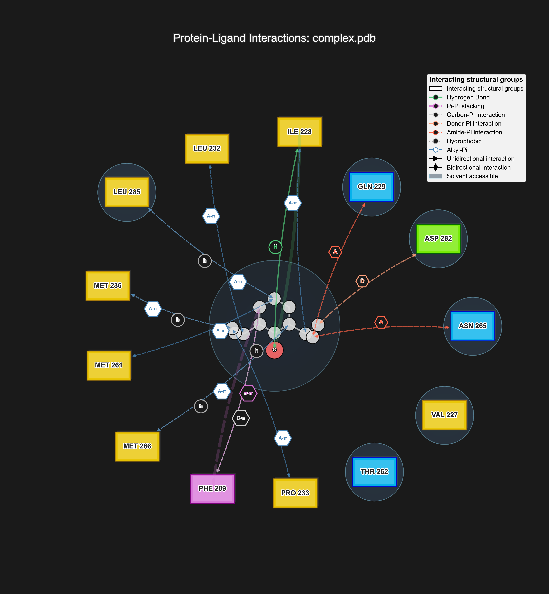
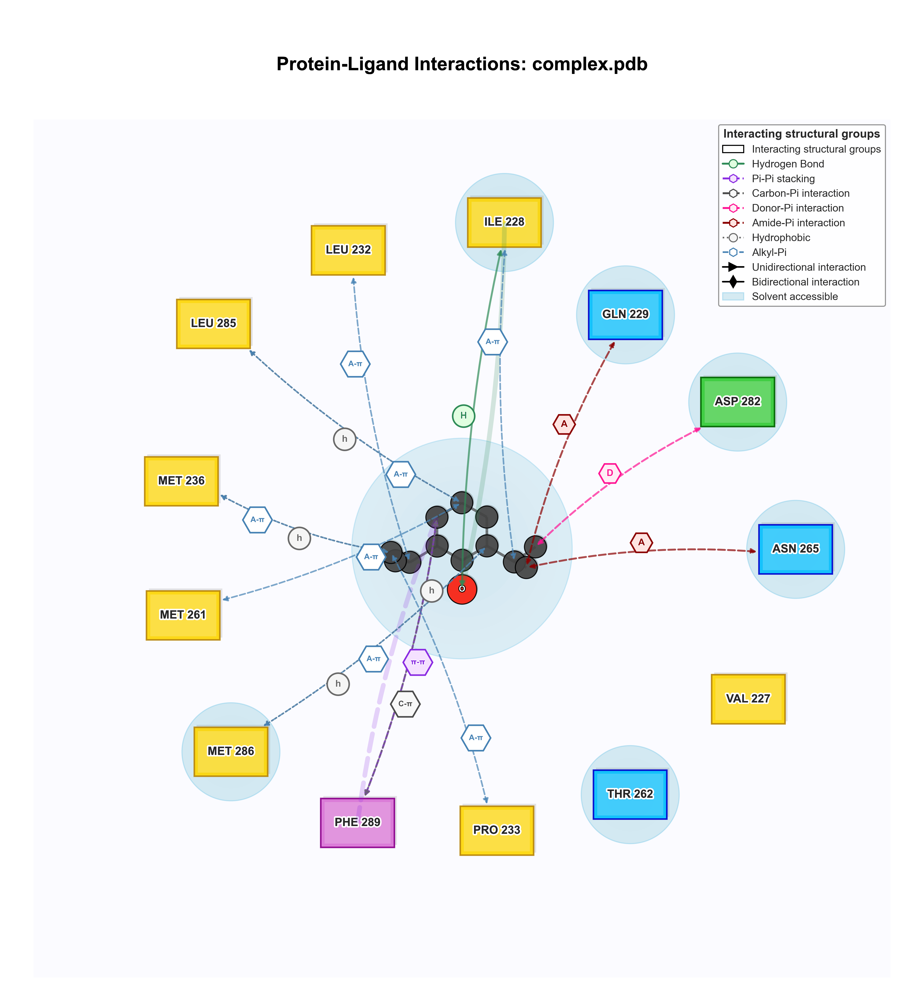
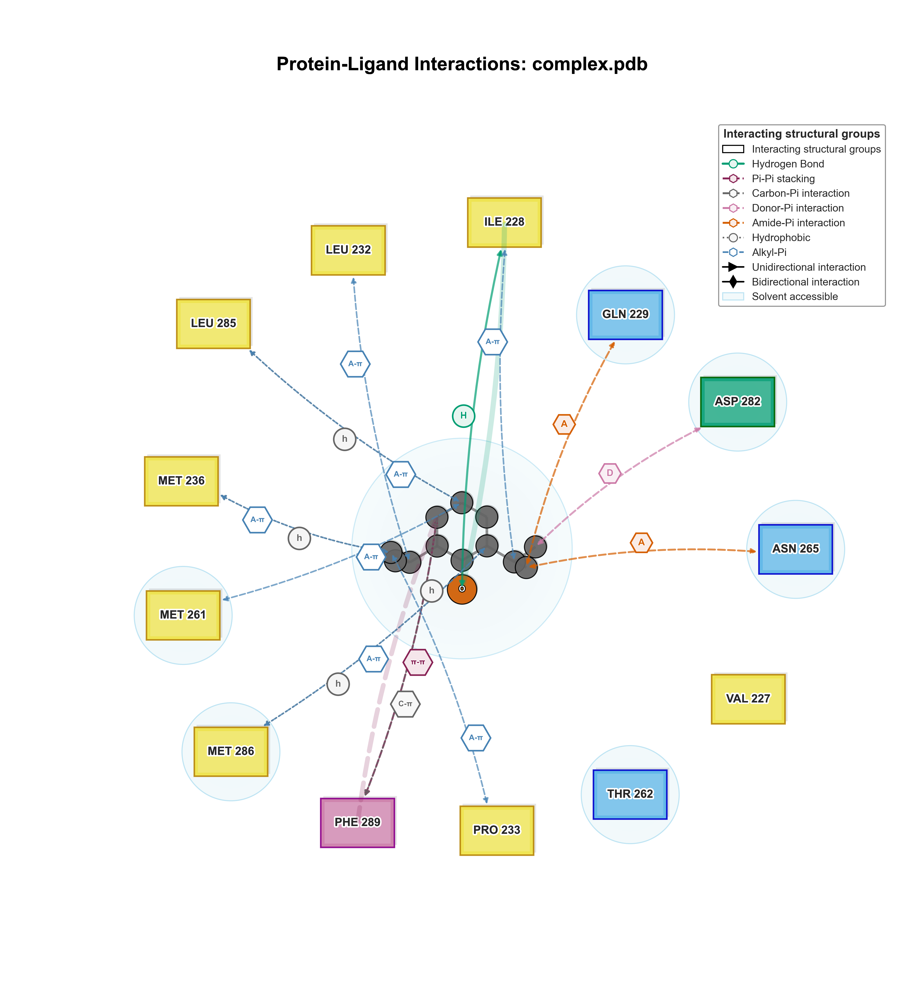
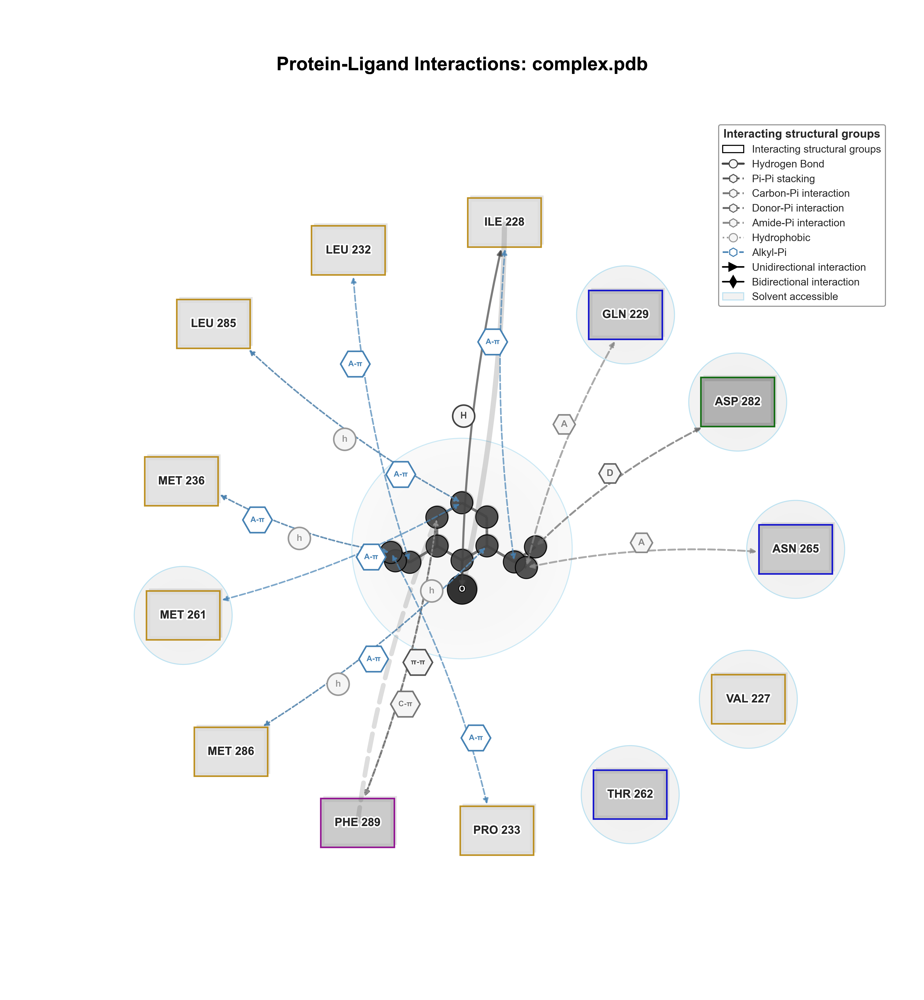
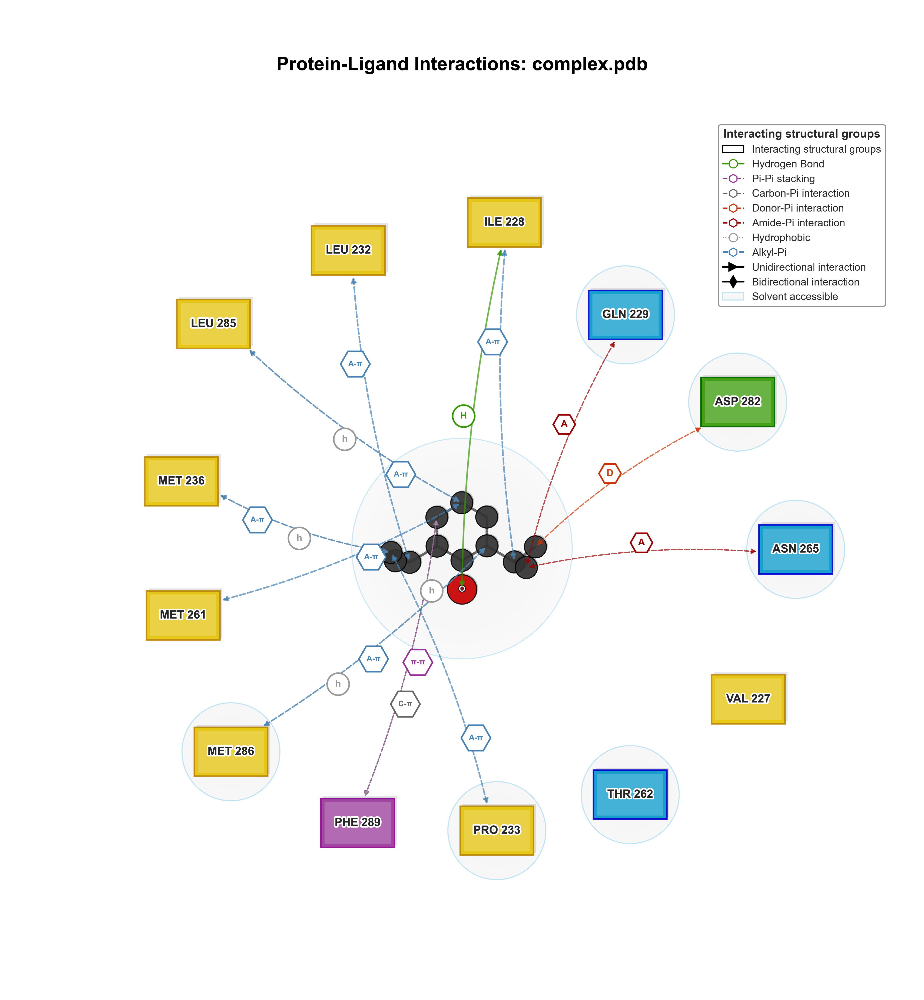
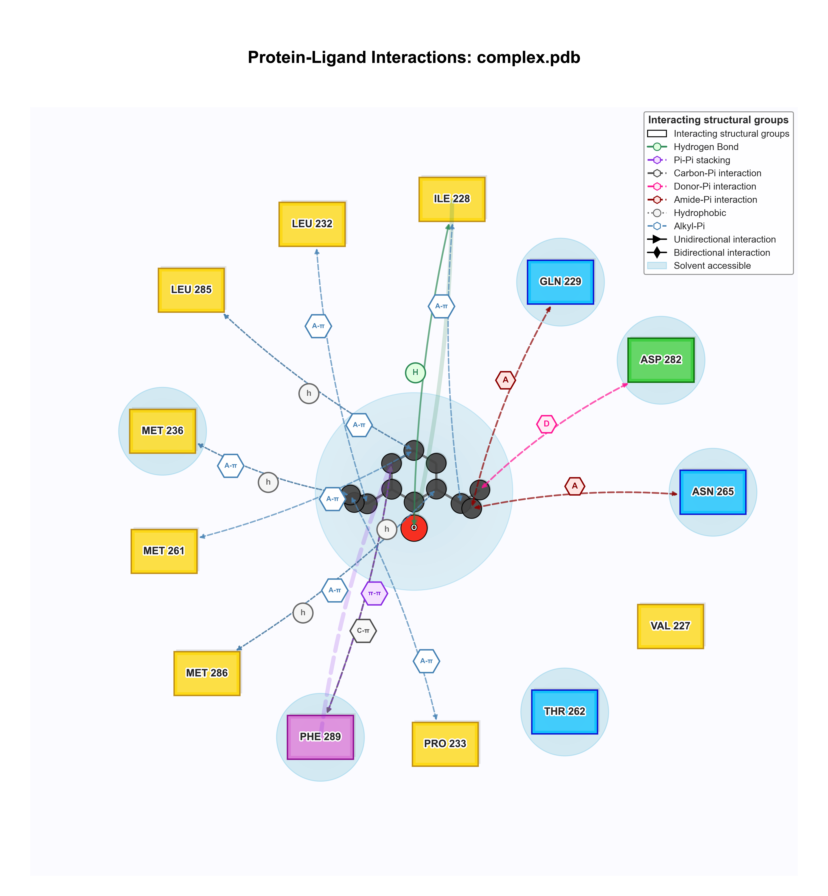

# PandaMap-Color: A versatile tool for protein-ligand interaction visualization with customizable color schemes.

<p align="center">
  
</p>

# Overview

PandaMap-Color is a powerful Python package for visualizing protein-ligand interactions in 2D with customizable color schemes. Generate publication-quality interaction diagrams directly from PDB files with minimal configuration.

### Key Features

- **Stunning Visualizations**: Create detailed, publication-ready 2D diagrams of protein-ligand interactions
- **Multiple Color Schemes**: Choose from several pre-defined color schemes (Default, Colorblind-friendly, Monochrome, Dark mode, Publication-ready)
- **Customizable Appearance**: Easily modify colors and styling to match your publication or presentation needs
- **Automatic Interaction Detection**: Identifies hydrogen bonds, π-π stacking, hydrophobic interactions, and more
- **Intuitive Representation**: Clearly shows interaction types between protein residues and ligands
- **Command Line Interface**: Simple to use in scripts or from the terminal

## Installation

```bash
pip install pandamap-color
```

## Quick Start
```bash
PandaMapColor: Visualize protein-ligand interactions from PDB files with
customizable styling and coloring options.

positional arguments:
  pdb_file              Path to PDB file with protein-ligand complex

options:
  -h, --help            show this help message and exit
  --output OUTPUT, -o OUTPUT
                        Output image file path
  --ligand LIGAND, -l LIGAND
                        Specific ligand residue name to analyze
  --dpi DPI             Image resolution (default: 300 dpi)
  --title TITLE, -t TITLE
                        Custom title for the visualization
  --color-scheme {default,colorblind,monochrome,dark,publication}, -c {default,colorblind,monochrome,dark,publication}
                        Color scheme to use (default: default)
  --custom-colors CUSTOM_COLORS
                        Path to JSON file with custom color scheme
  --simple-styling      Use simple styling instead of enhanced effects
  --no-color-by-type    Disable coloring residues by amino acid type
  --jitter JITTER       Amount of positional randomization (0.0-1.0) for more
                        natural look
  --h-bond-cutoff H_BOND_CUTOFF
                        Distance cutoff for hydrogen bonds in Angstroms
  --pi-stack-cutoff PI_STACK_CUTOFF
                        Distance cutoff for pi-stacking interactions in
                        Angstroms
  --hydrophobic-cutoff HYDROPHOBIC_CUTOFF
                        Distance cutoff for hydrophobic interactions in
                        Angstroms
  --figsize FIGSIZE FIGSIZE
                        Figure size in inches (width height)
```
### Command Line Usage

```bash
# Basic usage
pandamap-color path/to/complex.pdb -o output_image.png

# Specify ligand residue name (if multiple ligands in file)
pandamap-color path/to/complex.pdb --ligand LIG -o output_image.png

# Change color scheme
pandamap-color path/to/complex.pdb --color-scheme publication -o output_image.png
pandamap-color path/to/complex.pdb --color-scheme monochrome -o output_image.png
pandamap-color path/to/complex.pdb --color-scheme colorblind -o output_image.png
pandamap-color path/to/complex.pdb --color-scheme dark -o output_image.png

#Jitter
pandamap-color path/to/complex.pdb --jitter 0.3 --color-scheme publication -o output_image.png

# Help
pandamap-color --help
```

### Python API Usage

```python
from pandamap_color import PandaMapColor

# Create a mapper instance
mapper = PandaMapColor(
    pdb_file="path/to/complex.pdb",
    ligand_resname="LIG",  # Optional: specify ligand residue name
    color_scheme="default",
    use_enhanced_styling=True
)

# Detect interactions
mapper.detect_interactions()

# Identify solvent-accessible residues
mapper.estimate_solvent_accessibility()

# Generate visualization
mapper.visualize(output_file="interaction_diagram.png")
```

## Examples

### Dark Style


### Default Style


### Colorblind-Friendly Style


### Monochrome Mode


### Publication Mode


### No Color By Type Mode


## Available Color Schemes

PandaMap-Color comes with multiple built-in color schemes:

- `default`: Standard vibrant colors
- `colorblind`: Colorblind-friendly palette
- `monochrome`: Grayscale for simple publications
- `dark`: Dark background for presentations
- `publication`: Clean style for scientific publications

## Custom Color Schemes

You can define custom color schemes using JSON:

```python
import json
from pandamap_color import PandaMapColor

# Define a custom color scheme
custom_colors = {
    "element_colors": {
        "C": "#333333",
        "N": "#3060F0",
        "O": "#FF2010",
        # Add more elements...
    },
    "interaction_styles": {
        "hydrogen_bonds": {
            "color": "#2E8B57",
            "linestyle": "-",
            # More styling options...
        },
        # More interaction types...
    }
}

# Save to a file (optional)
with open("my_colors.json", "w") as f:
    json.dump(custom_colors, f, indent=2)

# Use with the mapper
mapper = PandaMapColor(
    pdb_file="path/to/complex.pdb",
    color_scheme=custom_colors  # Pass the dictionary directly
)

# Or load from file
mapper = PandaMapColor(
    pdb_file="path/to/complex.pdb",
    color_scheme="my_colors.json"  # Or path to JSON file
)
```

## Documentation

For detailed documentation, see:
- [Usage Guide](docs/usage.md)
- [Color Scheme Reference](docs/color_schemes.md)
- [API Reference](docs/api.md)

## Package Structure

PandaMap-Color is organized into modular components:

- **pandamap.py**: Main `PandaMapColor` class for protein-ligand interaction analysis
- **visualization.py**: Visualization functionality for creating beautiful diagrams
- **ligand.py**: Ligand structure representation and 2D projection
- **colorschemes.py**: Pre-defined color schemes and customization utilities
- **cli.py**: Command-line interface
- **utils.py**: Utility functions and helper classes

## Requirements

- Python 3.7+
- NumPy
- Matplotlib
- BioPython

## Citing PandaMap-Color

If you use PandaMap-Color in your research, please cite:

```
Pritam Kumar Panda. (2025). PandaMap-Color: A versatile tool for protein-ligand interaction visualization with customizable color schemes.
```

## License

This project is licensed under the MIT License - see the [LICENSE](LICENSE) file for details.

## Contributing

Contributions are welcome! Please feel free to submit a Pull Request.

1. Fork the repository
2. Create your feature branch (`git checkout -b feature/amazing-feature`)
3. Commit your changes (`git commit -m 'Add some amazing feature'`)
4. Push to the branch (`git push origin feature/amazing-feature`)
5. Open a Pull Request
